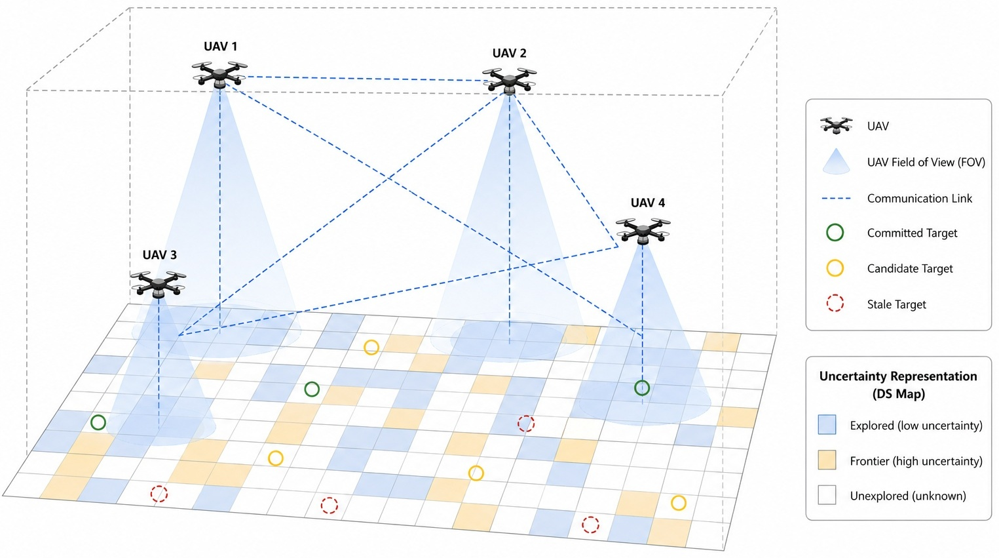
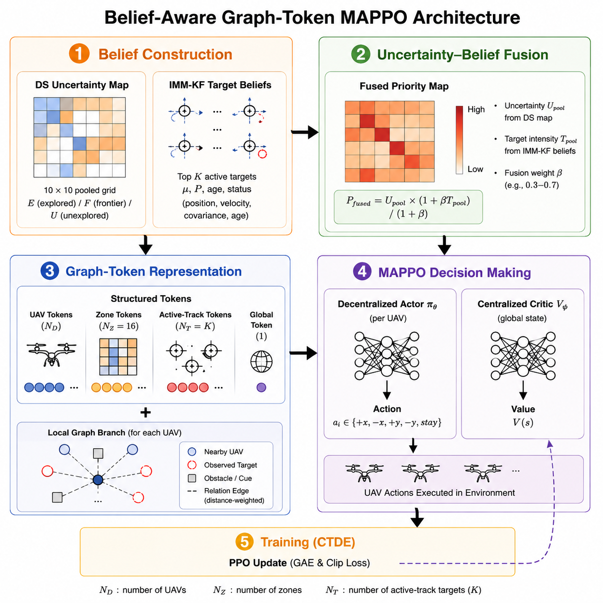
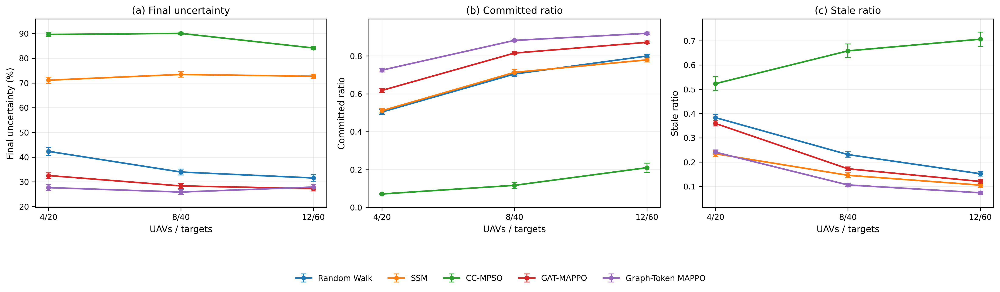

# Belief-Aware Graph-Token MAPPO for Multi-UAV Search and Persistent Tracking

<p align="center">
  <b>Mission-Level Decision-Making for Simultaneous Search and Persistent Target Tracking</b>
</p>

<p align="center">
  Yeongseok Choi and Jongeun Choi
</p>

<p align="center">
  <a href="#installation">Installation</a> •
  <a href="#training">Training</a> •
  <a href="#evaluation">Evaluation</a> •
  <a href="#pretrained-checkpoints">Checkpoints</a> •
  <a href="#citation">Citation</a>
</p>

---

<p align="center">
  
</p>

## Overview

This repository provides the official implementation of **Belief-Aware Graph-Token MAPPO**, a multi-agent reinforcement learning framework for simultaneous multi-UAV area search and persistent target tracking.

The framework focuses on **mission-level decision making** rather than low-level flight control. Each UAV decides how to balance spatial exploration with the maintenance and reacquisition of previously detected targets.

The proposed method combines:

- Dempster--Shafer (DS) spatial uncertainty representation
- IMM-KF target state and uncertainty estimation
- Belief-aware active-track tokens
- Uncertainty--belief fused priority maps
- Structured graph-token observations
- Multi-Agent Proximal Policy Optimization (MAPPO) under CTDE

The main configuration uses **12 active-track slots (`K=12`)**.

---

## Method

<p align="center">
  
</p>

The environment maintains two complementary belief representations.

**Spatial uncertainty** describes how reliable the team's knowledge of previously searched regions remains over time.

**Target belief** is maintained using an Interacting Multiple Model Kalman Filter (IMM-KF), which estimates target position, velocity, covariance, and track age during intermittent observations.

These representations are fused and provided to the policy through structured UAV, zone, active-track, and global tokens. A graph branch additionally represents local relationships among UAVs.

The policy is trained using MAPPO with centralized training and decentralized execution.

---

## Experimental Scenarios

The main experiments evaluate fixed UAV-to-target ratios at three mission scales:

| Scenario | UAVs | Targets |
|---|---:|---:|
| Small | 4 | 20 |
| Medium | 8 | 40 |
| Large | 12 | 60 |

Additional experiments include:

- Independent multi-seed robustness evaluation
- Target-density stress testing
- Component ablation studies
- Belief-feature masking
- IMM-KF tracker analysis
- Fused-priority sensitivity analysis
- Active-track token-budget sensitivity (`K = 8, 12, 16`)
- Computational-cost analysis

---

## Key Result

In the largest `12 UAV / 60 target` scenario, Graph-Token MAPPO provides stronger persistent target-belief maintenance than GAT-MAPPO under the selected main checkpoints.

| Method | Mean tr(P) ↓ | Avg. Committed ↑ | Avg. Stale ↓ |
|---|---:|---:|---:|
| GAT-MAPPO | 0.0279 ± 0.0067 | 0.872 ± 0.037 | 0.120 ± 0.037 |
| **Graph-Token MAPPO** | **0.0253 ± 0.0059** | **0.920 ± 0.036** | **0.074 ± 0.036** |

The results indicate that explicitly exposing target-belief quality to the policy improves persistent tracking while maintaining competitive spatial search performance.

<p align="center">
  
</p>

---

## Repository Structure

```text
belief-aware-graph-token-mappo/
│
├── isaac_env_v13.py
├── graph_token_mappo_v13.py
├── gat_mappo_v13.py
├── gat_obs_wrapper_v13.py
├── token_ppo_v3.py
├── heuristics_v13.py
│
├── graph_token_wo_fused_v13.py
├── graph_token_wo_track_v13.py
├── graph_token_mappo_v13_beta0.py
├── graph_token_mappo_v13_beta1.py
├── graph_token_mappo_v13_k8.py
├── graph_token_mappo_v13_k12.py
├── graph_token_mappo_v13_k16.py
│
├── eval_v13_scale_all.py
├── eval_v13_ablation.py
├── eval_v13_tracker_ablation.py
├── eval_v13_belief_feature_masking.py
├── eval_v13_beta_sensitivity.py
├── eval_v13_density_stress.py
├── eval_v13_belief_trace.py
├── eval_seed_robustness_all.py
├── eval_kslot_sensitivity_all.py
│
├── run_seed_training_all.py
├── run_kslot_training_all.py
├── measure_compute_cost.py
├── measure_pipeline_breakdown.py
│
├── environment.yml
├── assets/
└── README.md
```

---

## Installation

The code was developed and tested with **Python 3.10** and **PyTorch 2.7.0**.

### 1. Clone the repository

```bash
git clone https://github.com/choiaidrone/belief-aware-graph-token-mappo.git
cd belief-aware-graph-token-mappo
```

### 2. Create the Conda environment

```bash
conda env create -f environment.yml
conda activate graph-token-mappo
```

### 3. Install PyTorch

The experiments were conducted with PyTorch 2.7.0 and CUDA 11.8.

```bash
pip install torch==2.7.0 torchvision==0.22.0 torchaudio==2.7.0 --index-url https://download.pytorch.org/whl/cu118
```

Verify the installation:

```bash
python -c "import torch; print(torch.__version__); print(torch.cuda.is_available())"
```

---

## Training

The main Graph-Token MAPPO and GAT-MAPPO policies are trained in the
4-UAV / 20-target scenario for **3,000 episodes** using seed 0.

### Main Graph-Token MAPPO

```bash
python graph_token_mappo_v13.py --stage 1 --seed 0
```

The default Stage-1 training budget is 3,000 episodes.

A different training budget can be specified explicitly using:

```bash
python graph_token_mappo_v13.py --stage 1 --seed 0 --episodes 1500
```

### Main GAT-MAPPO baseline

```bash
python gat_mappo_v13.py --stage 1 --seed 0
```

### Multi-seed robustness training

```bash
python run_seed_training_all.py
```

This script trains Graph-Token MAPPO and GAT-MAPPO independently with
five training seeds (`0--4`) using a matched reduced budget of
**1,500 episodes per policy**.

### Active-track token-budget sensitivity

```bash
python run_kslot_training_all.py
```

This script separately trains the `K=8`, `K=12`, and `K=16`
Graph-Token MAPPO variants using seed 0 and a matched budget of
**1,500 episodes per variant**.

---

## Evaluation

Pretrained checkpoints are not stored directly in this GitHub repository.
They will be distributed separately as an archived release.

Evaluation scripts support explicit checkpoint paths through their
corresponding command-line options.

### Main scalability evaluation

The main evaluation uses 100 stochastic episodes for each of the
`4x20`, `8x40`, and `12x60` scenarios.

If the models were trained using the default repository structure,
the evaluation script automatically searches the seed-0 checkpoint
directories.

```bash
python eval_v13_scale_all.py --n_eval 100
```

Alternatively, checkpoint files can be specified explicitly:

```bash
python eval_v13_scale_all.py --n_eval 100 --ckpt_gat "/path/to/gat_checkpoint.pt" --ckpt_graph_token "/path/to/graph_token_checkpoint.pt"
```

### Ablation study

```bash
python eval_v13_ablation.py
```

The `w/o graph`, `w/o fused priority`, and `w/o active-track`
checkpoints can also be specified explicitly through the corresponding
`--ckpt_wo_*` options.

### Tracker ablation

```bash
python eval_v13_tracker_ablation.py
```

### Belief-feature masking

```bash
python eval_v13_belief_feature_masking.py
```

### Fused-priority sensitivity

```bash
python eval_v13_beta_sensitivity.py
```

### Target-density stress test

```bash
python eval_v13_density_stress.py
```

### Multi-seed robustness evaluation

```bash
python eval_seed_robustness_all.py --episodes 100 --checkpoint_ep 1500 --device cuda --seeds 0 1 2 3 4
```

This evaluation treats each independently trained policy as the
statistical unit. Each of the five Graph-Token MAPPO and five GAT-MAPPO
policies is evaluated over 100 matched stochastic evaluation episodes.

### Active-track token-budget sensitivity

```bash
python eval_kslot_sensitivity_all.py --episodes 100 --checkpoint_ep 1500 --device cuda --ks 8 12 16 --scales 12x60
```

This evaluates the separately trained `K=8`, `K=12`, and `K=16`
variants over 100 matched stochastic evaluation episodes in the
12-UAV / 60-target scenario.

Use

```bash
python <script_name>.py --help
```

to inspect additional checkpoint, output-directory, scale, seed,
and evaluation options.

---

## Pretrained Checkpoints

Pretrained checkpoints will be distributed separately from the source-code repository.

The planned release includes checkpoints for:

- Main Graph-Token MAPPO
- Main GAT-MAPPO baseline
- Independent robustness seeds
- `K=8`, `K=12`, and `K=16` sensitivity variants
- Selected ablation configurations

A permanent archive link and DOI will be added after the archived release is deposited.

---

## Reproducibility Notes

The main Graph-Token MAPPO and GAT-MAPPO checkpoints are trained for
3,000 episodes using seed 0.

The independent training-seed robustness experiment uses a matched
reduced training budget of 1,500 episodes for each of five seeds per
learning method. Statistical comparisons in this experiment use the
independently trained policy as the statistical unit.

The active-track token-budget sensitivity experiment separately trains
the `K=8`, `K=12`, and `K=16` variants for 1,500 episodes using seed 0.
This experiment is interpreted as a fixed-checkpoint sensitivity
diagnostic rather than an estimate of training-run variability.

> **Legacy note:** `token_ppo_v3.py` is retained for the Token-MAPPO
> (`w/o graph`) ablation model definition and inference. Its legacy
> standalone v12 training entry point is not part of the reproduction
> workflow provided in this repository.

---

## Citation

If you use this repository in your research, please cite the associated paper.

```bibtex
@article{choi2026beliefaware,
  title   = {Belief-Aware Graph-Token MAPPO for Mission-Level Decision-Making
             in Multi-UAV Search and Persistent Tracking},
  author  = {Choi, Yeongseok and Choi, Jongeun},
  year    = {2026}
}
```

The final journal citation and software DOI will be added after publication and archival release.

---

## License

License information will be added before the public release of this repository.

---

## Acknowledgment

This repository accompanies the research implementation of Belief-Aware Graph-Token MAPPO for multi-UAV search and persistent target tracking.
