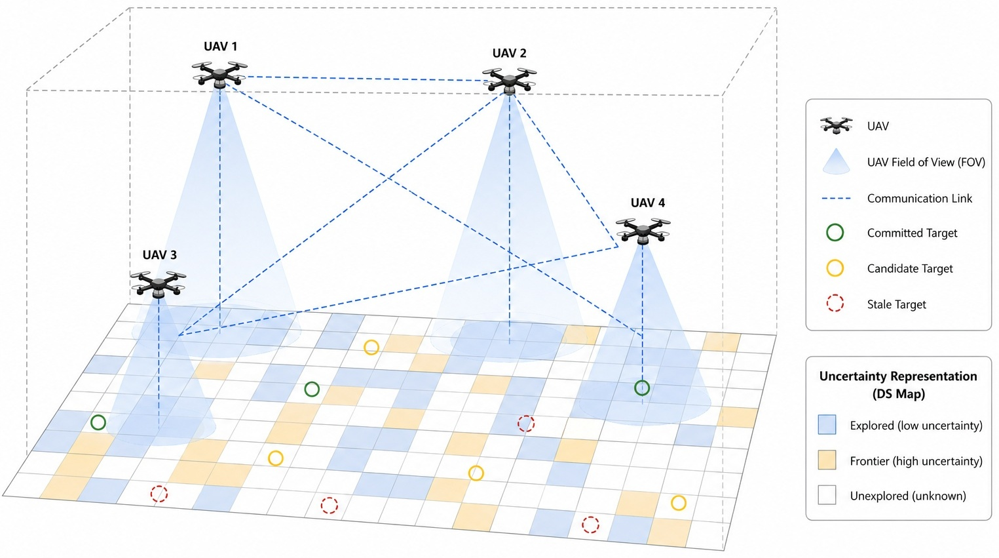
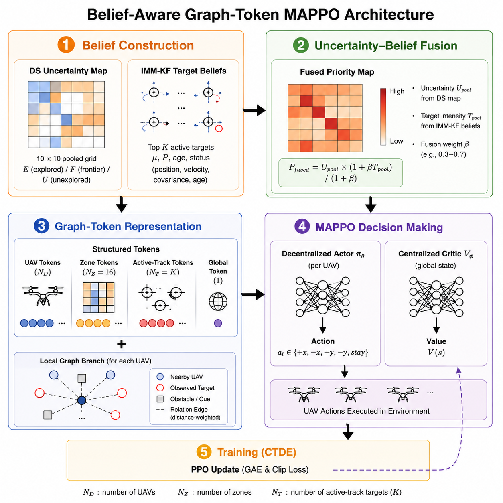
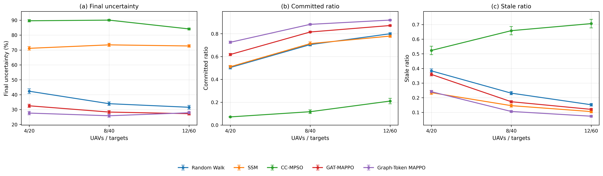

# BSR-MAPPO for Multi-UAV Search and Persistent Target Tracking

<p align="center">
  <b>Belief-Aware Structured-Relational Multi-Agent Proximal Policy Optimization</b>
</p>

<p align="center">
  Yeongseok Choi and Jongeun Choi
</p>

<p align="center">
  <a href="#installation">Installation</a> •
  <a href="#training">Training</a> •
  <a href="#evaluation">Evaluation</a> •
  <a href="#pretrained-checkpoints">Checkpoints</a> •
  <a href="#citation">Citation</a>
</p>

---

<p align="center">
  
</p>

## Overview

This repository provides the official implementation of **BSR-MAPPO (Belief-Aware Structured-Relational Multi-Agent Proximal Policy Optimization)** for simultaneous multi-UAV area search and persistent target tracking.

The framework focuses on **mission-level decision making** rather than low-level flight control. Each UAV must balance reduction of spatial uncertainty with maintenance and reacquisition of previously detected target beliefs.

The implementation was originally developed under the internal name **Graph-Token MAPPO**. For reproducibility, legacy filenames such as `graph_token_mappo_v13.py` are retained, while **BSR-MAPPO** is used as the method name in the journal manuscript and documentation.

The proposed framework combines:

- Dempster--Shafer (DS) spatial uncertainty representation
- Interacting Multiple Model Kalman Filter (IMM-KF) target-state and belief estimation
- Belief-aware active-track tokens containing target state, normalized covariance trace, and track age
- Uncertainty--belief fused priority maps
- Structured UAV, zone, active-track, and global tokens
- A local graph branch for relational coordination
- Multi-Agent Proximal Policy Optimization (MAPPO) under centralized training and decentralized execution (CTDE)

The main configuration uses **12 active-track slots (`K=12`)** and fusion weight **`beta=0.5`**.

---

## Method

<p align="center">
  
</p>

The environment maintains two complementary information states.

**Spatial belief** is represented with a Dempster--Shafer map. Empty evidence, target evidence, and uncertainty are maintained separately, and temporal decay gradually increases uncertainty in regions that have not been observed recently.

**Target belief** is maintained with an IMM-KF. The tracker estimates target position, velocity, covariance, and track age during intermittent observation. The full covariance matrix is maintained internally by the estimator, while its normalized trace is exposed to the mission-level policy as a compact belief-quality feature.

The policy receives four structured token types: **UAV**, **zone**, **active-track**, and **global** tokens. A graph branch additionally represents local relational information around each UAV.

The global tracker maintains all target beliefs. Only the highest-priority `K` active tracks are exposed to the actor at each step; omitted tracks are not deleted and can re-enter the active-track set when their priority increases.

The policy is trained using MAPPO with CTDE.

---

## Target Classes and Motion Models

The simulator contains four target classes: **infantry, tank, artillery, and anti-air**.

The current experiments treat **anti-air only as a target category**. Active anti-air threat effects on UAV survival, routing, or reward are disabled in the reported experiments (`ANTIAIR_KILL_PENALTY = 0.0`).

The target-belief tracker uses target-dependent motion-model sets:

- Tank: Constant Velocity (CV) + Coordinated Turn (CT)
- Artillery: Static + Slow-CV
- Infantry: Static + Slow-CV
- Anti-air: Static + Slow-CV in the current implementation

These model sets and transition probabilities are fixed motion priors rather than learned parameters.

---

## Experimental Scenarios

The main experiments evaluate fixed UAV-to-target ratios at three mission scales:

| Scenario | UAVs | Targets |
|---|---:|---:|
| Small | 4 | 20 |
| Medium | 8 | 40 |
| Large | 12 | 60 |

The main policies are trained at `4 UAV / 20 targets` and evaluated at all three scales without retraining.

Additional experiments include:

- Independent multi-seed robustness evaluation
- Target-density stress testing with 8 UAVs and 20--120 targets
- Component ablation studies
- Belief-feature masking
- IMM-KF tracker diagnostics
- Fused-priority sensitivity analysis
- Active-track token-budget sensitivity (`K = 8, 12, 16`)
- Computational-cost analysis

---

## Key Result

In the largest `12 UAV / 60 target` scenario, BSR-MAPPO provides stronger persistent target-belief maintenance than GAT-MAPPO under the selected main checkpoints, although GAT-MAPPO has a slightly lower terminal covariance and slightly lower final map uncertainty.

| Method | Final mean tr(P) ↓ | Time-avg. mean tr(P) ↓ | Committed Ratio ↑ | Stale Ratio ↓ | Final Uncertainty (%) ↓ |
|---|---:|---:|---:|---:|---:|
| GAT-MAPPO | **0.3099 ± 0.1071** | 0.2843 ± 0.0354 | 0.872 ± 0.037 | 0.120 ± 0.037 | **27.25 ± 4.79** |
| **BSR-MAPPO** | 0.3365 ± 0.1033 | **0.2307 ± 0.0418** | **0.920 ± 0.036** | **0.074 ± 0.036** | 27.88 ± 5.23 |

These results should be interpreted jointly. BSR-MAPPO does not dominate every terminal search or covariance metric; its advantage is most consistent in **trajectory-wide belief quality and target-maintenance state**.

<p align="center">
  
</p>

---

## Repository Structure

```text
belief-aware-graph-token-mappo/
│
├── isaac_env_v13.py
├── graph_token_mappo_v13.py        # BSR-MAPPO implementation (legacy filename)
├── gat_mappo_v13.py
├── gat_obs_wrapper_v13.py
├── token_ppo_v3.py
├── heuristics_v13.py
│
├── graph_token_wo_fused_v13.py
├── graph_token_wo_track_v13.py
├── graph_token_mappo_v13_beta0.py
├── graph_token_mappo_v13_beta1.py
├── graph_token_mappo_v13_k8.py
├── graph_token_mappo_v13_k12.py
├── graph_token_mappo_v13_k16.py
│
├── eval_v13_scale_all.py
├── eval_v13_ablation.py
├── eval_v13_tracker_ablation.py
├── eval_v13_belief_feature_masking.py
├── eval_v13_beta_sensitivity.py
├── eval_v13_density_stress.py
├── eval_v13_belief_trace.py
├── eval_seed_robustness_all.py
├── eval_kslot_sensitivity_all.py
│
├── run_seed_training_all.py
├── run_kslot_training_all.py
├── measure_compute_cost.py
├── measure_pipeline_breakdown.py
│
├── environment.yml
├── assets/
└── README.md
```

---

## Installation

The code was developed and tested with **Python 3.10** and **PyTorch 2.7.0**.

### 1. Clone the repository

```bash
git clone https://github.com/choiaidrone/belief-aware-graph-token-mappo.git
cd belief-aware-graph-token-mappo
```

### 2. Create the Conda environment

```bash
conda env create -f environment.yml
conda activate graph-token-mappo
```

### 3. Install PyTorch

The experiments were conducted with PyTorch 2.7.0 and CUDA 11.8.

```bash
pip install torch==2.7.0 torchvision==0.22.0 torchaudio==2.7.0 --index-url https://download.pytorch.org/whl/cu118
```

Verify the installation:

```bash
python -c "import torch; print(torch.__version__); print(torch.cuda.is_available())"
```

---

## Training

The main BSR-MAPPO and GAT-MAPPO policies are trained in the `4 UAV / 20 target` scenario for **3,000 episodes** using seed 0.

### Main BSR-MAPPO

```bash
python graph_token_mappo_v13.py --stage 1 --seed 0
```

The public implementation retains the legacy `graph_token_*` filenames for checkpoint and script compatibility.

The reported Stage-1 reward configuration is:

| Parameter | Value |
|---|---:|
| Uncertainty-reduction weight | 1.5 |
| Target-belief maintenance weight | 0.3 |
| Stale-track penalty weight | 0.01 |
| Reacquisition reward weight | 0.5 |
| Inter-UAV collision penalty | -1.0 |
| Anti-air kill penalty | 0.0 |

A different training budget can be specified explicitly using:

```bash
python graph_token_mappo_v13.py --stage 1 --seed 0 --episodes 1500
```

### Main GAT-MAPPO baseline

```bash
python gat_mappo_v13.py --stage 1 --seed 0
```

### Multi-seed robustness training

```bash
python run_seed_training_all.py
```

This script trains BSR-MAPPO and GAT-MAPPO independently with five training seeds (`0--4`) using a matched reduced budget of **1,500 episodes per policy**.

### Active-track token-budget sensitivity

```bash
python run_kslot_training_all.py
```

This script separately trains the `K=8`, `K=12`, and `K=16` BSR-MAPPO variants using seed 0 and a matched budget of **1,500 episodes per variant**.

---

## Evaluation

Unless otherwise stated, the main scalability and target-density results are reported as **mean ± one standard deviation over 100 stochastic evaluation episodes from a fixed trained checkpoint**. These error bars characterize episode-level stochasticity, not variation across independently trained policies.

Training-run variability is assessed separately in the five-seed robustness experiment.

### Main scalability evaluation

```bash
python eval_v13_scale_all.py --n_eval 100
```

The main evaluation covers `4x20`, `8x40`, and `12x60` without retraining.

Explicit checkpoint paths can also be provided:

```bash
python eval_v13_scale_all.py --n_eval 100 --ckpt_gat "/path/to/gat_checkpoint.pt" --ckpt_graph_token "/path/to/bsr_checkpoint.pt"
```

### Ablation study

```bash
python eval_v13_ablation.py
```

### Tracker diagnostic

```bash
python eval_v13_tracker_ablation.py
```

### Belief-feature masking

```bash
python eval_v13_belief_feature_masking.py
```

### Fused-priority sensitivity

```bash
python eval_v13_beta_sensitivity.py
```

### Target-density stress test

```bash
python eval_v13_density_stress.py
```

### Multi-seed robustness evaluation

```bash
python eval_seed_robustness_all.py --episodes 100 --checkpoint_ep 1500 --device cuda --seeds 0 1 2 3 4
```

Each independently trained policy is the statistical unit. Each of the five BSR-MAPPO and five GAT-MAPPO policies is evaluated over 100 matched stochastic evaluation episodes. Episode-level values are first averaged within each checkpoint before across-training-run statistics are calculated.

### Active-track token-budget sensitivity

```bash
python eval_kslot_sensitivity_all.py --episodes 100 --checkpoint_ep 1500 --device cuda --ks 8 12 16 --scales 4x20 8x40 12x60
```

This evaluates the separately trained `K=8`, `K=12`, and `K=16` variants at all three mission scales.

Use

```bash
python <script_name>.py --help
```

to inspect additional checkpoint, output-directory, scale, seed, and evaluation options.

---

## Pretrained Checkpoints

Pretrained checkpoints are not stored directly in this GitHub source repository.

The archived checkpoint package is intended to include:

- Main BSR-MAPPO checkpoint
- Main GAT-MAPPO baseline checkpoint
- Independent robustness seeds
- `K=8`, `K=12`, and `K=16` sensitivity variants
- Selected ablation configurations

The permanent archive/DOI should be cited here once the archived release is finalized.

---

## Reproducibility Notes

The main BSR-MAPPO and GAT-MAPPO checkpoints are trained for **3,000 episodes using seed 0**.

The independent training-seed robustness experiment uses a matched reduced training budget of **1,500 episodes for each of five seeds per learning method**. Statistical comparisons in this experiment use the independently trained policy as the statistical unit.

The active-track token-budget sensitivity experiment separately trains the `K=8`, `K=12`, and `K=16` variants for **1,500 episodes using seed 0**.

> **Legacy filename note:** `graph_token_mappo_v13.py` implements the method referred to as BSR-MAPPO in the journal manuscript. The legacy filename is retained to preserve compatibility with existing checkpoints and evaluation scripts.

> **Legacy ablation note:** `token_ppo_v3.py` is retained for the Token-MAPPO (`w/o graph`) ablation model definition and inference. Its legacy standalone v12 training entry point is not part of the reproduction workflow provided in this repository.

---

## Citation

If you use this repository in your research, please cite the associated manuscript and software repository.

```bibtex
@article{choi2026bsrmappo,
  title   = {BSR-MAPPO: Belief-Aware Structured-Relational Multi-Agent Proximal Policy Optimization for Multi-UAV Search and Persistent Target Tracking},
  author  = {Choi, Yeongseok and Choi, Jongeun},
  year    = {2026}
}
```

The final Robotics and Autonomous Systems citation and software DOI will be added after publication and archival release.

---

## License

This project is released under the MIT License. See [LICENSE](LICENSE) for details.

---

## Acknowledgment

This repository accompanies the BSR-MAPPO research implementation for multi-UAV search and persistent target tracking.
